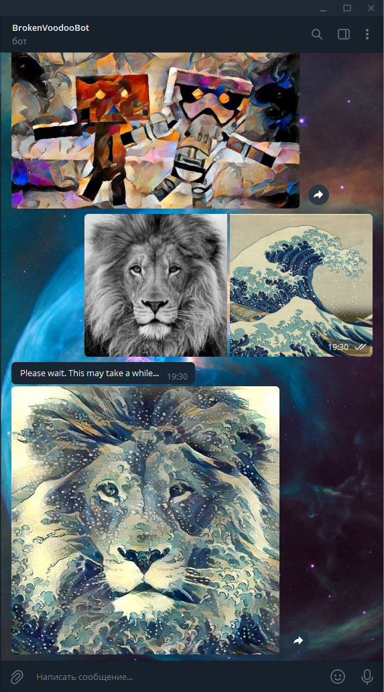

# Style Transfer Bot



## Описание

Данный репозиторий содержит код телеграм-бота для переноса стиля.

## Установка

1. Установите [Anaconda](https://anaconda.org/)

2. Склонируйте репозиторий с подмодулями

``` bash
git clone --recurse-submodule https://github.com/BrokenVoodooDoll/style-transfer-bot
```

3. Перейдите в папку neural_style_transfer и установите подмодуль

```bash
cd style-transfer-bot/neural_style_transfer
conda env create
activate pytorch-nst
export PYTHON_PATH="${PYTHONPATH}:/path/to/style-transfer-bot/neural_style_transfer"
```

4. Установите библиотеку для телеграм-ботов, находясь в окружении pytorch-nst

```bash
pip install python-telegram-bot --pre
```

5. Получите токен для бота с помощью [@BotFather](https://t.me/BotFather), 
скопируйте его в файл `token.txt` и положите в корне репозитория

## Использование

Перед запуском бота необходимо активировать виртуальное окружение через `conda`
и добавить модуль нейросети в `PYTHONPATH`. Затем можно запускать бота.

```bash
cd /path/to/style-transfer-bot
activate pytorch-nst
export PYTHON_PATH="${PYTHONPATH}:/path/to/style-transfer-bot/neural_style_transfer"
python main.py
```

Далее в боте необходимо отправить две фотографии: первая - на которую нужно
перенести стиль, вторая - стиль которой нужно перенести. Порядок отправки важен.
Фото можно загрузить по очереди, а можно одним сообщением. Параллельность работы
пока что не реализована, так что пользоваться ботом сразу с нескольких телефонов
проблематично. Подсказка по использованию бота также вызывается с помощью команды
`/help`.

## Демонстрация работы

Пример работы бота, снятый на видео, доступен по [ссылке](https://drive.google.com/file/d/1I_clvARSahqdRijOhTKbkUXGiiQ_OEWQ/view?usp=sharing)

## Зависимости

* [python-telegram-bot](https://github.com/python-telegram-bot/python-telegram-bot)
* [pytorch-neural-style-transfer](https://github.com/gordicaleksa/pytorch-neural-style-transfer)